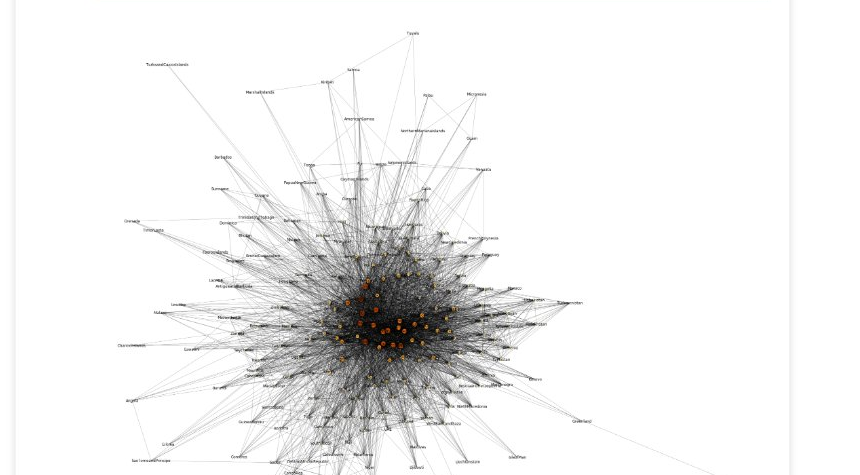
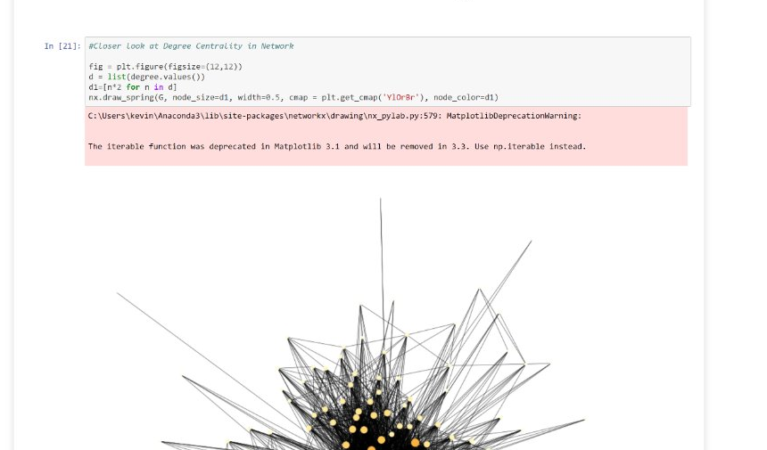
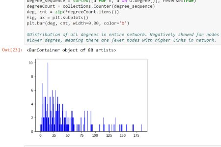
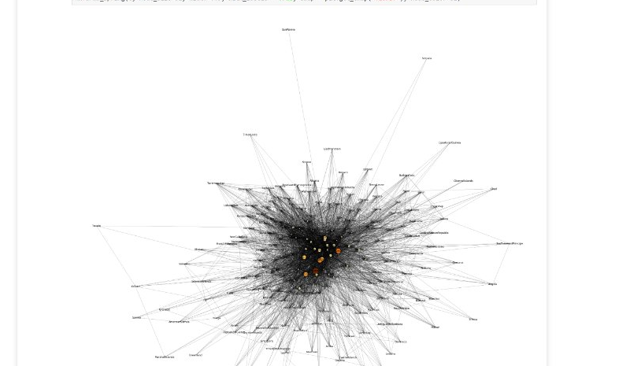
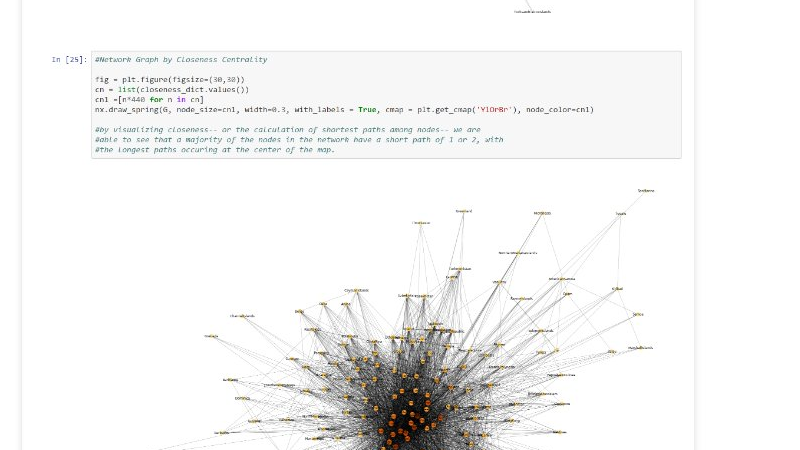
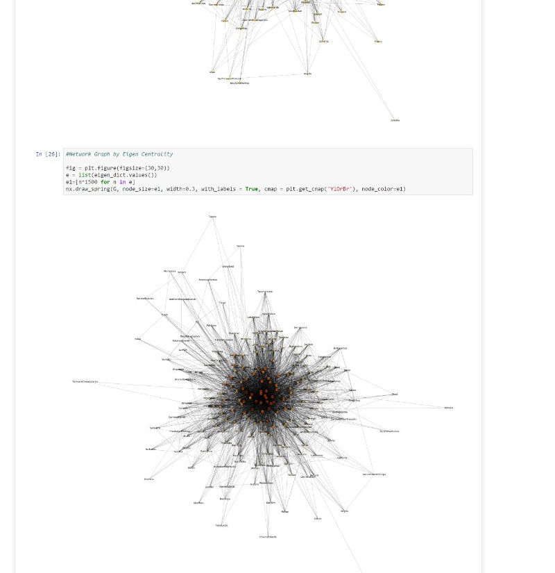

# Social Network Analysis of Global Remittance Flows & Syrian Transnational Migration

**Kevin Jun Ha**

## Overview

This project applies social network analysis (SNA) to global bilateral remittance data to examine the transnational network of the Syrian Arab Republic. Using KNOMAD's 2017 bilateral remittance matrices as a foundation, I constructed a country-level network where nodes represent countries and edges represent remittance relationships — treating any financial flow (sent or received) as evidence of maintained transnational ties.

The project spans the full data pipeline: raw KNOMAD matrices → data transformation → network construction → centrality analysis → visualization.

## Research Questions

- What countries maintain transnational ties to the Syrian Arab Republic, and to what degree are those ties embedded within the broader global remittance network?
- What is the directionality of remittance flows involving Syria, and what does this reveal about Syria's structural position in the global migration economy?

## Key Findings

- **207 nodes** (countries) and **~4,337 edges** in the network
- **Average degree of ~41.9** — each country maintains remittance ties with roughly 42 others on average
- **Network diameter of 3** — the maximum distance between any two countries in the remittance flow network is just 3 steps
- Top nodes by centrality (betweenness, closeness, degree, eigenvector): United States, France, United Kingdom, Canada, Australia
- Syria has **direct (1-step) remittance connections** to all major hub countries including the US, UK, France, Canada, Australia, Germany, and China
- Syria is a strong **net receiver** of remittances: 32 countries send into Syria vs. only 2 receiving from Syria (Iraq and West Bank & Gaza)

## Visualizations

**Full Network — Degree Centrality**

**Closer Look — Degree Centrality**

**Degree Distribution Histogram**

**Betweenness Centrality**

**Closeness Centrality**

**Eigenvector Centrality**

## Methods & Tools

- **Language:** Python
- **Libraries:** NetworkX, pandas, matplotlib, plotly, NumPy
- **Centrality measures:** Degree, Betweenness, Closeness, Eigenvector
- **Data source:** KNOMAD Bilateral Remittance Matrices (2017)

## Repository Structure
├── Remittances_SNA_KevinJunHa.ipynb   # Main analysis notebook
├── data/
│   ├── raw/                            # Original KNOMAD bilateral remittance matrices
│   └── processed/
│       ├── remittance_edgelist_noweight2.csv
│       └── remittance_nodelistv3.csv
└── images/                             # Network visualizations

## Future Work

A key extension of this project is incorporating KNOMAD matrices from multiple years to enable longitudinal analysis — tracking how Syria's network position, diaspora corridors, and remittance asymmetry evolve over time, particularly in relation to key geopolitical events.

## Skills Demonstrated

`Python` · `NetworkX` · `Social Network Analysis` · `pandas` · `Data Wrangling` · `matplotlib` · `Quantitative Research` · `Migration Studies`

## Background

This project was completed as part of graduate-level coursework in computational social science, with a substantive focus on transnational migration theory.
